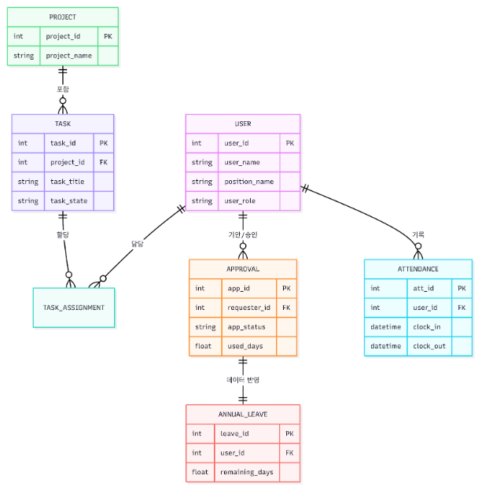

# [상세 도메인 설계서 v6.0] Mini ERP 통합 그룹웨어 시스템

---

## 1. 프로젝트 개요 (Project Overview)

### 1.1 프로젝트 목적
- **통합 업무 환경 제공**: 프로젝트 관리, 업무(Task), 연차/특근 결재, 근태, 캘린더 기능을 하나의 시스템으로 통합함.
- **역할 기반 운영 효율화**: `ADMIN`, `TEAM_LEADER`, `USER` 역할에 따라 조회 범위와 가능한 기능을 구분해 실무 흐름에 맞는 업무 처리를 지원함.
- **데이터 정합성 확보**: 업무 상태, 프로젝트 상태, 대시보드 통계, 연차 차감, 특근 승인 결과가 서로 어긋나지 않도록 설계함.

### 1.2 핵심 가치 (Core Values)
- **통합(Integration)**: 프로젝트/업무 관리와 인사성 기능을 하나의 플랫폼에서 처리
- **권한(Role-based Access)**: 사용자 역할에 따라 데이터 범위와 기능을 분리
- **정합성(Consistency)**: 상태 변화가 연관 데이터에 함께 반영되도록 보장
- **가시성(Visibility)**: 대시보드, 캘린더, 요약 통계를 통해 현재 상태를 빠르게 파악

### 1.3 프로젝트 범위 (Scope)
- **인증 및 사용자 관리**: 회원가입, 로그인, 아이디 찾기, 비밀번호 재설정, 사용자 조회/수정/권한 변경
- **프로젝트/업무 관리**: 프로젝트 생성 및 팀장/멤버 관리, Task 생성/배정/상태 변경
- **대시보드**: 역할별 진행률, 프로젝트 현황, 결재/업무 통계 조회
- **연차/특근 결재**: 신청, 승인, 반려, 취소, 목록 조회
- **근태/캘린더**: 출퇴근 기록, 월별 요약, 승인된 일정 통합 조회

### 1.4 주요 이해관계자
| 구분 | 역할 | 주요 관심사 |
|---|---|---|
| 일반 사용자 | 시스템 사용자 | 본인 업무 조회/상태 변경, 연차·특근 신청, 근태 확인 |
| 팀장 | 중간 관리자 | 담당 프로젝트 범위의 업무 관리, 일반 사용자 결재 처리, 팀 단위 현황 확인 |
| 관리소장 | 최고 관리자 | 전사 프로젝트/사용자/통계 관리, 팀장 신청 결재, 권한 변경 |

---

## 2. 비즈니스 도메인 분석

### 2.1 핵심 비즈니스 프로세스

#### 2.1.1 사용자 인증 및 권한 활용 프로세스
`A[회원가입] ➔ B[로그인] ➔ C[JWT Access Token 발급] ➔ D[역할별 화면/기능 접근]`

**상세 플로우**
- **회원가입 단계**: 사용자가 로그인 ID, 이름, 이메일, 비밀번호, 부서, 직책 정보를 입력해 계정을 생성함.
- **로그인 단계**: 로그인 ID와 비밀번호를 검증한 뒤 JWT Access Token을 발급함.
- **권한 활용 단계**: 로그인한 사용자의 `userRole`에 따라 조회 가능한 데이터 범위와 허용 기능이 달라짐.

#### 2.1.2 프로젝트 및 업무 관리 프로세스
`A[프로젝트 생성] ➔ B[팀장 지정 및 멤버 배정] ➔ C[Task 생성 및 담당자 배정] ➔ D[Task 상태 변경] ➔ E[프로젝트 상태 및 대시보드 반영]`

**상세 플로우**
- **프로젝트 구성 단계**: 관리소장이 프로젝트를 만들고 팀장을 지정한 뒤 프로젝트 멤버를 배정함.
- **업무 배정 단계**: 관리소장 또는 팀장이 Task를 생성하고 프로젝트 멤버에게 담당자를 배정함.
- **업무 수행 단계**: 일반 사용자는 본인에게 배정된 Task를 조회하고 상태를 변경함.
- **상태 반영 단계**: Task 상태가 바뀌면 프로젝트 상태가 함께 갱신되고, 대시보드는 요청 시점 집계 결과를 반환함.

#### 2.1.3 연차 결재 프로세스
`A[연차 신청] ➔ B[PENDING 상태 저장] ➔ C[승인권자 검토] ➔ D[승인/반려/취소] ➔ E[연차 수량/목록 반영]`

**상세 플로우**
- **신청 단계**: 사용자가 연차 유형, 기간, 사유를 입력해 신청함.
- **검증 단계**: 주말/공휴일 포함 여부, 중복 신청 여부, 과거 날짜 여부를 서버에서 검증함.
- **승인 단계**: `USER` 신청 건은 `TEAM_LEADER`, `TEAM_LEADER` 신청 건은 `ADMIN`이 처리함.
- **후속 처리 단계**: 승인 시 연차 사용 일수가 사용자 잔여 연차에 즉시 반영됨.

#### 2.1.4 특근 및 근태 프로세스
`A[주말 특근 신청] ➔ B[승인] ➔ C[주말 출근 허용] ➔ D[근태 기록 및 월별 요약 반영]`

**상세 플로우**
- **특근 신청 단계**: 사용자는 주말 일정에 대해서만 특근을 신청할 수 있음.
- **승인 단계**: 승인 계층은 연차와 동일하게 적용됨.
- **근태 기록 단계**: 사용자는 출근/퇴근을 기록하고, 주말 출근은 승인된 특근이 있는 경우에만 허용됨.
- **조회 단계**: 월별 근태 요약과 캘린더 이벤트로 통합 조회 가능함.

### 2.2 비즈니스 이벤트 (Business Events)
| 이벤트 | 트리거 (Trigger) | 결과 (Result) |
|---|---|---|
| 로그인 성공 | 사용자가 올바른 로그인 ID/비밀번호 제출 | Access Token 발급, 사용자 역할 정보 반환 |
| 프로젝트 생성 | 관리소장이 프로젝트 생성 요청 | 프로젝트 및 팀장 정보 저장 |
| 프로젝트 멤버 배정 | 관리소장/팀장이 팀원 배정 요청 | 프로젝트 접근 가능 사용자 범위 확장 |
| Task 상태 변경 | 담당자/팀장/관리소장이 상태 변경 요청 | Task 상태 변경, 프로젝트 상태 재계산 |
| 연차 승인 | 승인권자가 승인 처리 | 연차 상태 변경, 사용자 잔여 연차 차감 |
| 특근 승인 | 승인권자가 승인 처리 | 특근 상태 변경, 주말 출근 가능 상태 충족 |
| 출근 기록 | 사용자가 출근 요청 | 해당 날짜 근태 생성 및 상태 판정 |
| 캘린더 조회 | 사용자가 월별 일정 조회 | 승인된 연차/특근 일정 통합 반환 |

### 2.3 비즈니스 규칙 (Business Rules)
- **권한 관련**: 시스템 역할은 `ADMIN`, `TEAM_LEADER`, `USER` 3단계이며, 역할에 따라 데이터 범위와 허용 동작이 달라짐.
- **프로젝트 관련**: 관리소장만 프로젝트 생성/수정/팀장 변경 가능, 팀장은 본인 담당 프로젝트 범위만 관리 가능함.
- **업무 관련**: Task 담당자는 해당 프로젝트 멤버여야 하며, 일반 사용자는 본인에게 배정된 Task만 상태 변경 가능함.
- **대시보드 관련**: 진행률과 통계는 저장값이 아니라 요청 시점 집계로 계산함.
- **연차 관련**: 주말/공휴일 포함 신청 불가, 승인 시에만 실제 연차 차감, 취소 내역은 필터링 조회 가능함.
- **특근 관련**: 특근은 주말에만 신청 가능하며, 승인된 경우에만 주말 출근 정당성이 인정됨.
- **근태 관련**: 하루 출근 기록은 한 번만 가능하며, 주말 출근은 승인된 특근이 없으면 거부됨.

---

## 3. 핵심 도메인 객체 (Minimum Viable Product)

### 3.1 도메인 객체 식별 매트릭스
| 도메인 객체 | 유형 | 중요도 | 복잡도 | 비고 (Description) |
|---|---|---|---|---|
| User (사용자) | Entity | 높음 | 중간 | 인증, 권한, 연차 수량, 부서/직책 정보를 관리하는 기준 객체 |
| Project (프로젝트) | Entity | 높음 | 중간 | 업무의 상위 단위이며 팀장과 멤버 범위를 결정함 |
| ProjectMember (프로젝트 멤버) | Entity | 높음 | 중간 | 프로젝트와 사용자 간 배정 관계를 표현함 |
| Task (업무) | Entity | 높음 | 높음 | 프로젝트 내부의 실제 작업 단위이며 상태를 가짐 |
| TaskAssignment | Entity | 높음 | 중간 | Task와 사용자 간 다중 담당 관계를 표현함 |
| LeaveRequest (연차 신청) | Entity | 높음 | 높음 | 신청, 승인, 반려, 취소 상태를 가지는 결재 객체 |
| OvertimeRequest (특근 신청) | Entity | 중간 | 중간 | 주말 특근 신청과 승인 상태를 관리함 |
| Attendance (근태) | Entity | 중간 | 중간 | 출근/퇴근 및 근무일 상태를 관리함 |
| DashboardResponse | DTO/조회모델 | 중간 | 중간 | Task/Project 데이터를 집계한 역할별 통계 모델 |
| CalendarEvent | DTO/조회모델 | 중간 | 낮음 | 승인된 연차/특근을 월 단위 일정으로 반환하는 모델 |

### 3.2 상세 도메인 객체 정의

#### 3.2.1 User (사용자)
- **역할**: 인증과 권한의 기준이 되는 핵심 엔티티이며, 연차 수량과 직책 정보를 함께 보유함.
- **주요 속성**
  - id: 사용자 식별자
  - loginId: 로그인 ID
  - userName: 사용자 이름
  - userEmail: 이메일
  - userPw: 암호화된 비밀번호
  - departmentCode: 부서 코드
  - positionName: 직책명
  - userRole: 시스템 역할 (`ADMIN`, `TEAM_LEADER`, `USER`)
  - totalAnnualLeave / usedAnnualLeave / remainingAnnualLeave: 연차 수량
- **주요 행동 (메서드)**
  - updateProfile(): 사용자 정보 수정
  - changeRole(): 시스템 역할 변경
  - deductAnnualLeave(): 승인된 연차만큼 잔여 연차 차감
  - updatePassword(): 비밀번호 재설정 반영
- **비즈니스 규칙**
  - loginId와 userEmail은 중복될 수 없음
  - `ADMIN`만 사용자 권한 변경 가능
  - 연차 수량은 `User` 엔티티를 기준으로 관리함

#### 3.2.2 Project (프로젝트)
- **역할**: Task가 소속되는 상위 업무 단위이며, 팀장과 상태를 관리함.
- **주요 속성**
  - id: 프로젝트 식별자
  - title: 프로젝트명
  - content: 설명
  - startDate / endDate: 일정
  - priority: 우선순위
  - status: 프로젝트 상태 (`READY`, `PROGRESS`, `DONE`)
  - leader: 담당 팀장
- **주요 행동 (메서드)**
  - update(): 프로젝트 정보 수정
  - assignLeader(): 팀장 변경
  - updateStatusByTasks(): 전체 Task 상태를 기준으로 프로젝트 상태 재계산
- **비즈니스 규칙**
  - 생성/수정/팀장 변경은 `ADMIN`만 가능
  - 팀장은 `TEAM_LEADER` 또는 `ADMIN` 역할 사용자만 지정 가능
  - Task 상태 변화에 따라 프로젝트 상태가 함께 변경될 수 있음

#### 3.2.3 Task (업무)
- **역할**: 프로젝트 내부의 실제 작업 단위이며, 담당자와 상태를 관리함.
- **주요 속성**
  - id: 업무 식별자
  - taskTitle: 제목
  - taskContent: 내용
  - endDate: 마감일
  - taskStatus: 상태 (`TODO`, `DOING`, `DONE`)
  - priority: 우선순위
  - project: 소속 프로젝트
- **주요 행동 (메서드)**
  - update(): 제목/내용/마감일/우선순위 수정
  - changeStatus(): 상태 변경
- **비즈니스 규칙**
  - Task는 반드시 하나의 프로젝트에 속함
  - 담당자는 해당 프로젝트 멤버여야 함
  - 일반 사용자는 본인에게 배정된 Task만 상태 변경 가능

#### 3.2.4 TaskAssignment (업무 담당자 배정)
- **역할**: Task와 담당자(User) 사이의 다대다 관계를 표현함.
- **주요 속성**
  - id: 배정 식별자
  - task: 대상 업무
  - user: 담당자
- **주요 행동 (메서드)**
  - create(): 업무와 사용자 연결
- **비즈니스 규칙**
  - 동일 Task에 동일 사용자를 중복 배정할 수 없음
  - 프로젝트 멤버가 아닌 사용자는 배정할 수 없음

#### 3.2.5 LeaveRequest (연차 신청)
- **역할**: 연차 신청과 승인/반려/취소 상태를 표현하는 전자결재 객체.
- **주요 속성**
  - id(appId): 신청 식별자
  - requester: 기안자
  - approver: 승인자
  - appType: 연차 유형
  - startDate / endDate: 신청 기간
  - usedDays: 사용 일수
  - appStatus: 상태 (`PENDING`, `APPROVED`, `REJECTED`, `CANCELLED`)
  - rejectReason: 반려 사유
- **주요 행동 (메서드)**
  - calculateUsedDays(): 신청 기간 기준 사용 일수 계산
  - approve(): 승인 처리
  - reject(): 반려 처리
  - cancel(): 취소 처리
- **비즈니스 규칙**
  - 승인 시에만 사용자 연차 수량 차감
  - 주말/공휴일 포함 신청 불가
  - 본인 신청 건만 취소 가능
  - 승인 계층은 `USER -> TEAM_LEADER`, `TEAM_LEADER -> ADMIN`

#### 3.2.6 OvertimeRequest (특근 신청)
- **역할**: 주말 특근 신청과 승인 상태를 관리함.
- **주요 속성**
  - id: 신청 식별자
  - requester: 신청자
  - approver: 승인자
  - overtimeDate: 특근 날짜
  - startTime / endTime: 특근 시간
  - reason: 사유
  - status: 상태 (`PENDING`, `APPROVED`, `REJECTED`, `CANCELLED`)
- **주요 행동 (메서드)**
  - approve(): 승인 처리
  - reject(): 반려 처리
  - cancel(): 취소 처리
- **비즈니스 규칙**
  - 특근은 주말만 신청 가능
  - 종료 시간이 시작 시간보다 빠를 수 없음
  - 승인 계층은 연차와 동일

#### 3.2.7 Attendance (근태)
- **역할**: 일별 출퇴근 기록과 근태 상태를 관리함.
- **주요 속성**
  - id: 근태 식별자
  - user: 사용자
  - workDate: 근무일
  - clockInTime / clockOutTime: 출퇴근 시각
  - attStatus: 근태 상태
- **주요 행동 (메서드)**
  - checkIn(): 출근 기록 생성
  - checkOut(): 퇴근 기록 반영
  - updateAttendance(): 수동 수정
- **비즈니스 규칙**
  - 같은 날짜 출근 기록은 한 번만 생성 가능
  - 주말 출근은 승인된 특근이 없으면 거부됨

---

## 4. 도메인 관계도

### 4.1 개념적 관계도

### 4.2 관계 상세 설명
| 관계 | 카디널리티 | 설명 |
|---|---|---|
| User ↔ Project | 1:N / N:M | 한 명의 팀장은 여러 프로젝트를 담당할 수 있고, 일반 사용자는 `ProjectMember`를 통해 여러 프로젝트에 배정될 수 있음 |
| Project ↔ ProjectMember | 1:N | 하나의 프로젝트는 여러 멤버 배정 정보를 가질 수 있음 |
| Project ↔ Task | 1:N | 하나의 프로젝트는 여러 Task로 구성됨 |
| Task ↔ TaskAssignment | 1:N | 하나의 Task는 여러 담당자를 가질 수 있음 |
| User ↔ Task | N:M | 사용자는 `TaskAssignment`를 통해 여러 Task를 담당할 수 있음 |
| User ↔ LeaveRequest | 1:N | 한 사용자는 여러 연차 신청을 생성할 수 있음 |
| User ↔ OvertimeRequest | 1:N | 한 사용자는 여러 특근 신청을 생성할 수 있음 |
| User ↔ Attendance | 1:N | 한 사용자는 날짜별 근태 기록을 가질 수 있음 |

---

## 5. 비즈니스 규칙 (Business Rules)

### 5.1 회원 및 권한 관련 규칙
| 규칙 ID | 규칙 내용 |
|---|---|
| BR-M001 | 시스템 역할은 `ADMIN`, `TEAM_LEADER`, `USER` 3단계로 구분한다 |
| BR-M002 | `loginId`와 `userEmail`은 시스템 내에서 유일해야 한다 |
| BR-M003 | `ADMIN`만 사용자 권한 변경 및 전체 사용자 목록 필터 조회가 가능하다 |
| BR-M004 | 본인 정보는 본인 또는 `ADMIN`만 조회/수정할 수 있다 |

### 5.2 프로젝트 및 업무 관련 규칙
| 규칙 ID | 규칙 내용 |
|---|---|
| BR-P001 | 프로젝트 생성/수정/팀장 변경은 `ADMIN`만 가능하다 |
| BR-P002 | `TEAM_LEADER`는 본인이 담당하는 프로젝트 범위만 관리할 수 있다 |
| BR-P003 | 프로젝트 멤버 해제 시 해당 프로젝트의 TaskAssignment도 함께 정리한다 |
| BR-T001 | Task 담당자는 해당 프로젝트 멤버여야 한다 |
| BR-T002 | 일반 사용자는 본인에게 배정된 Task만 조회/상태 변경 가능하다 |
| BR-T003 | Task 상태 변경 후 프로젝트 상태를 함께 재계산한다 |

### 5.3 대시보드 관련 규칙
| 규칙 ID | 규칙 내용 |
|---|---|
| BR-D001 | 대시보드 진행률은 역할에 따라 집계 대상이 달라진다 |
| BR-D002 | 통계는 저장값이 아니라 요청 시점 집계 방식으로 계산한다 |
| BR-D003 | 프로젝트 현황은 진행 중 프로젝트 우선, 마감일 순으로 상위 5개를 반환한다 |

### 5.4 연차 및 특근 관련 규칙
| 규칙 ID | 규칙 내용 |
|---|---|
| BR-L001 | 주말/공휴일이 포함된 연차 신청은 거부한다 |
| BR-L002 | 승인된 연차만 사용자 잔여 연차에서 차감한다 |
| BR-L003 | `USER` 신청 건은 `TEAM_LEADER`, `TEAM_LEADER` 신청 건은 `ADMIN`만 처리할 수 있다 |
| BR-L004 | 취소된 내역은 `includeCancelled=true`일 때만 포함해 조회할 수 있다 |
| BR-O001 | 특근은 주말에만 신청할 수 있다 |
| BR-O002 | 특근 승인 계층은 연차와 동일하다 |

### 5.5 근태 및 캘린더 관련 규칙
| 규칙 ID | 규칙 내용 |
|---|---|
| BR-W001 | 하루 출근 기록은 한 번만 생성할 수 있다 |
| BR-W002 | 주말 출근은 승인된 특근이 없는 경우 거부한다 |
| BR-C001 | 캘린더는 승인된 연차와 승인된 특근 일정만 표시한다 |

---

## 6. 도메인 서비스 (Domain Services)

| 서비스명 | 책임 | 사용 시나리오 |
|---|---|---|
| AuthService | 회원가입, 로그인, 아이디 찾기, 비밀번호 재설정 | 인증 및 계정 복구 |
| UserService | 사용자 조회/수정/권한 변경 | 사용자 관리, 본인 정보 관리 |
| ProjectService | 프로젝트 생성/수정, 팀장/멤버/권한 관리, 진행률 조회 | 프로젝트 운영 |
| TaskService | Task 생성/수정/상태 변경, 담당자 관리, 최근 배정 이력 조회 | 업무 배정 및 수행 관리 |
| DashboardService | 역할별 진행률, 관리자/팀장 요약, 프로젝트 현황 조회 | 메인 대시보드 통계 |
| ApprovalService | 연차 신청/승인/반려/취소, 잔여 연차 및 정책 조회 | 연차 결재 처리 |
| OvertimeService | 특근 신청/승인/반려/취소, 목록 조회 | 특근 결재 처리 |
| AttendanceService | 출근/퇴근/수정/월별 요약 | 근태 기록 관리 |
| CalendarService | 승인된 연차/특근 일정 통합 조회 | 캘린더 표시 |
| AccessPolicy | 공통 권한 검증 및 승인 계층 검증 | 역할 기반 접근 제어 공통 정책 |

---

## 7. 용어 정의 (Glossary)

| 용어 | 정의 | 영문 |
|---|---|---|
| 관리소장 | 시스템 최상위 관리 권한을 가진 사용자 역할 | Admin |
| 팀장 | 담당 프로젝트 범위와 결재 처리 권한을 가진 중간 관리자 역할 | Team Leader |
| 일반 사용자 | 본인 업무 및 본인 신청 데이터 중심으로 사용하는 역할 | User |
| 프로젝트 진행률 | 완료된 Task 수를 기준으로 계산한 프로젝트 완료 비율 | Project Progress Rate |
| 업무 진행률 | TODO/DOING/DONE 집계를 기준으로 계산한 역할별 진행 통계 | Dashboard Progress |
| 기안자 | 연차/특근 신청을 올린 사용자 | Requester |
| 결재자 | 신청 건을 승인/반려할 권한을 가진 사용자 | Approver |
| 데이터 정합성 | 관련된 여러 데이터가 서로 모순 없이 일관된 상태를 유지하는 성질 | Data Consistency |

---

## 8. 가정사항 및 제약조건

### 8.1 가정사항 (Assumptions)
- 모든 API는 JWT Access Token 기반 인증 환경에서 사용됨
- 시간과 날짜는 한국 표준시(KST)를 기준으로 처리함
- 조직의 역할 체계는 `ADMIN`, `TEAM_LEADER`, `USER`로 고정함
- 대시보드 통계는 조회 시점의 DB 상태를 기준으로 계산함

### 8.2 제약조건 (Constraints)
- **기술적 제약**: 백엔드는 Spring Boot, 인증은 JWT, 저장소는 RDBMS(MariaDB) 기반으로 구성함
- **권한 제약**: 동일 API라도 역할에 따라 데이터 범위가 달라지므로 프론트엔드는 `userRole`에 따라 UI를 분기해야 함
- **정합성 제약**: Task 상태 변경, 연차 승인, 특근 승인 같은 상태 전이는 트랜잭션 단위로 처리해야 함
- **문서화 제약**: REST API 문서는 현재 구현 기준으로 Swagger와 함께 유지해야 함
