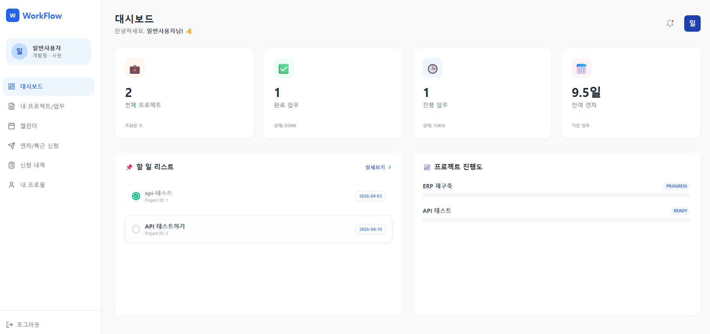
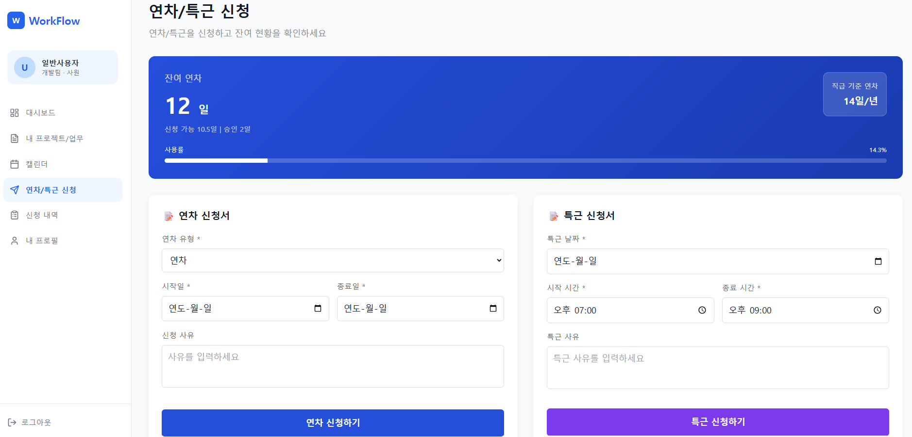

# UI 화면 설계서 템플릿 (통합 그룹웨어 시스템)

## 문서 정보
| 항목 | 내용 |
|------|------|
| **프로젝트명** | 사내 프로젝트 트래킹 및 연차 전자결재 |
| **작성자** | 팀 작성 |
| **작성일** | 2026-03-30 |
| **버전** | v2.0 |
| **검토자** | 프론트엔드 개발팀 |

---

## 1. 화면 목록 개요

### 1.1 전체 페이지 목록

| No | 화면명 | URL 경로 | 권한 | 화면 타입 |
|----|--------|----------|------|-----------|
| 1 | 로그인 페이지 | `/login` | 공개 | 입력 |
| 2 | 회원가입 페이지 | `/register` | 공개 | 입력 |
| 3 | 아이디 찾기 페이지 | `/find-id` | 공개 | 입력 |
| 4 | 아이디 찾기 결과 페이지 | `/find-id/result` | 공개 | 결과 |
| 5 | 비밀번호 찾기(본인확인) | `/find-password` | 공개 | 입력 |
| 6 | 비밀번호 찾기(인증번호) | `/find-password/verify` | 공개 | 입력 |
| 7 | 비밀번호 찾기(재설정) | `/find-password/reset` | 공개 | 입력 |
| 8 | 비밀번호 재설정 완료 | `/find-password/success` | 공개 | 완료 |
| 9 | 통합 대시보드 | `/dashboard` | 로그인 필요 | 조회 |
| 10 | 프로젝트 목록 페이지 | `/projects` | 로그인 필요 | 목록 |
| 11 | 프로젝트 상세(칸반) | `/projects/:id` | 로그인 필요 | 칸반/상세 |
| 12 | 연차/휴가 신청 페이지 | `/leaves/new` | 로그인 필요 | 입력 |
| 13 | 내 결재 내역 페이지 | `/leaves/me` | 로그인 필요 | 목록 |
| 14 | 결재 대기 목록(관리자) | `/admin/approvals` | 관리자 전용 | 목록 |
| 15 | 출퇴근 기록/근태 현황 | `/attendance` | 로그인 필요 | 입력/조회 |
| 16 | 가입 승인 관리(관리자) | `/admin/users` | 관리자 전용 | 목록 |
| 17 | 프로젝트 팀원 배정(관리자) | `/admin/projects/:id/members` | 관리자 전용 | 관리 |

### 1.2 권한별 접근 정책

| 권한 레벨 | 접근 가능 화면 | 비고 |
|-----------|---------------|------|
| **공개(비로그인)** | 로그인, 회원가입, 아이디 찾기, 비밀번호 찾기/재설정 | 다른 URL 접근 시 로그인 리다이렉트 (Access Token 없음) |
| **로그인(ROLE_USER)** | 대시보드, 프로젝트, 칸반, 연차 신청/내역, 출퇴근 | 본인 배정 프로젝트/업무 데이터만 조회 가능 |
| **관리자(ADMIN)** | 전체 화면 접근 가능 | 가입 승인, 프로젝트 팀원 배정, Task 담당자 배정, 연차 승인/반려 가능 |

---

## 2. 전체 레이아웃 구조

### 2.1 공통 레이아웃 (일반 사용자)
```
┌──────────────────────────────────────────────────────┐
│  Header                                              │
│  [SmartWork 로고] [알림] [사용자 프로필]               │
├──────────────────────────────────────────────────────┤
│  Sidebar (좌측)          │ Main Content Area          │
│  [대시보드]               │ (각 페이지 콘텐츠)         │
│  [프로젝트]               │                            │
│  [전자결재]               │                            │
│  [근태관리]               │                            │
│  [관리자] (ADMIN only)    │                            │
├──────────────────────────────────────────────────────┤
│  Footer: SmartWork                                    │
└──────────────────────────────────────────────────────┘
```

### 2.2 공통 컴포넌트 목록
| 컴포넌트명 | 위치 | 역할 | 항상 표시 |
|------------|------|------|-----------|
| `Header` | 상단 | 로고, 네비게이션, 로그인 상태 | 예 |
| `SidebarNav` | 좌측 | 메뉴 이동, 권한별 메뉴 노출 | 예 |
| `Footer` | 하단 | 저작권, 링크 | 예 |
| `LoadingSpinner` | 콘텐츠 영역 | 데이터 로딩 중 표시 | 상황별 |
| `Pagination` | 목록 하단 | 페이지 이동 | 목록 화면 |
| `ErrorMessage` | 콘텐츠 영역 | API 실패 메시지 표준 표시 | 상황별 |

---

## 3. 화면별 상세 설계

> **작성 방법**: 아래 템플릿을 복사하여 각 화면마다 작성하세요.

---

### 화면 ID: SCR-[번호] — [화면명]

#### 3.x.1 화면 개요
| 항목 | 내용 |
|------|------|
| **화면명** | [화면명] |
| **URL** | `[경로]` |
| **화면 타입** | [ ] 목록 [ ] 상세 [ ] 입력 [ ] 대시보드 [ ] 모달 |
| **권한 레벨** | [ ] 공개 [ ] 로그인 필요 [ ] 관리자 전용 |
| **주요 기능** | [이 화면에서 사용자가 할 수 있는 일 2~4가지] |
| **연결 API** | `[API 엔드포인트]` |

#### 3.x.2 와이어프레임 (ASCII)
```
┌──────────────────────────────────────────────────────┐
│ Header                                               │
├──────────────────────────────────────────────────────┤
│                                                      │
│  [화면 요소를 ASCII로 표현]                             │
│                                                      │
│  예시:                                               │
│  ┌─────────┐  ┌──────────────────────┐              │
│  │ 검색창  │  │     검색 버튼         │              │
│  └─────────┘  └──────────────────────┘              │
│                                                      │
│  ┌──────────────────────────────────────────┐       │
│  │  데이터 테이블                            │       │
│  │  제목 | 상태 | 담당자 | 기간 | 액션       │       │
│  │  ...  | ...  | ...   | ... | 버튼       │       │
│  └──────────────────────────────────────────┘       │
│                                                      │
│  [◀] [1] [2] [3] ... [10] [▶]  (페이지네이션)        │
└──────────────────────────────────────────────────────┘
```

#### 3.x.3 UI 컴포넌트 매핑
| 화면 요소 | React 컴포넌트 | shadcn/ui 컴포넌트 | 비고 |
|-----------|---------------|-------------------|------|
| [요소명] | `[ComponentName]` | `[Button/Input/...]` | [설명] |
| 검색창 | `SearchBar` | `Input` + `Button` | 조건 검색 |

#### 3.x.4 화면 상태 목록
| 상태 | 표시 내용 | 트리거 |
|------|-----------|--------|
| **로딩 중** | LoadingSpinner 표시 | API 호출 시작 |
| **데이터 있음** | 정상 화면 표시 | API 성공 |
| **데이터 없음** | "결과가 없습니다" 안내 | 빈 목록 |
| **에러** | ErrorMessage 표시 | API 실패 |

#### 3.x.5 사용자 인터랙션 흐름
```
[사용자 액션] → [컴포넌트 이벤트] → [상태 변경] → [UI 업데이트]

예시:
[상태 변경 버튼 클릭]
    → [확인 모달 표시] → [확인 클릭]

---

### 화면 ID: SCR-003 — 계정 복구 플로우 (피그마 반영)

#### 3.3.1 화면 개요
| 항목 | 내용 |
|------|------|
| **화면명** | 아이디 찾기 / 비밀번호 찾기/재설정 |
| **URL** | `/find-id`, `/find-id/result`, `/find-password`, `/find-password/verify`, `/find-password/reset`, `/find-password/success` |
| **화면 타입** | [x] 입력 [x] 결과 [x] 완료 |
| **권한 레벨** | [x] 공개 |
| **주요 기능** | 아이디 조회, 이메일 인증번호 검증, 새 비밀번호 재설정 |
| **연결 API** | `POST /api/v1/auth/find-id`, `POST /api/v1/auth/password/otp/send`, `POST /api/v1/auth/password/otp/verify`, `POST /api/v1/auth/password/reset` |

#### 3.3.2 화면 상태 목록
| 상태 | 표시 내용 | 트리거 |
|------|-----------|--------|
| **아이디 찾기 성공** | "아이디를 찾았어요" + 마스킹/실제 ID 표시 | API 성공 |
| **인증번호 발송 완료** | 단계 1→2 진행 + 안내 문구 | OTP 발송 성공 |
| **인증 실패** | "인증번호가 올바르지 않습니다" | OTP 검증 실패 |
| **재설정 완료** | 완료 일러스트 + 로그인 이동 버튼 | 비밀번호 변경 성공 |

#### 3.3.3 사용자 인터랙션 흐름
```
[아이디 찾기]
    → POST /api/v1/auth/find-id
    → 성공: /find-id/result 이동

[비밀번호 찾기 1단계: 본인확인]
    → POST /api/v1/auth/password/otp/send
    → 성공: /find-password/verify 이동

[비밀번호 찾기 2단계: 인증번호]
    → POST /api/v1/auth/password/otp/verify
    → 성공: /find-password/reset 이동

[비밀번호 찾기 3단계: 재설정]
    → POST /api/v1/auth/password/reset
    → 성공: /find-password/success 이동
```

---

### 화면 ID: SCR-004 — 관리자 결재 반려 사유 모달 (피그마 반영)

#### 3.4.1 화면 개요
| 항목 | 내용 |
|------|------|
| **화면명** | 결재 반려 사유 입력 모달 |
| **URL** | `/admin/approvals` 내 모달 |
| **화면 타입** | [x] 모달 |
| **권한 레벨** | [x] 관리자 전용 |
| **주요 기능** | 반려 사유 입력, 반려 처리, 입력 검증 |
| **연결 API** | `PATCH /api/v1/leave/requests/{requestId}/reject` |

#### 3.4.2 UI 컴포넌트 매핑
| 화면 요소 | React 컴포넌트 | 라이브러리 컴포넌트 | 비고 |
|-----------|---------------|-------------------|------|
| 반려 모달 | `RejectApprovalModal` | `Dialog` | 결재 목록에서 호출 |
| 반려 사유 입력 | `RejectReasonField` | `Textarea` | 필수 입력 |
| 취소/반려 버튼 | `RejectActions` | `Button` | 반려 시 API 호출 |

#### 3.4.3 사용자 인터랙션 흐름
```
[반려 버튼 클릭]
    → RejectApprovalModal 오픈
    → 반려 사유 입력
    → PATCH /api/v1/leave/requests/{requestId}/reject
    → 성공: 목록 상태 REJECTED 갱신
    → 실패: REJECT_REASON_REQUIRED 메시지
```
    → [PATCH API 호출] → [성공] 목록 갱신
                       → [실패] 에러 메시지 표시
```

---

### 화면 ID: SCR-001 — 연차/휴가 신청 페이지 (작성 예시)

#### 3.1.1 화면 개요
| 항목 | 내용 |
|------|------|
| **화면명** | 연차/휴가 신청 페이지 |
| **URL** | `/leaves/new` |
| **화면 타입** | [x] 입력 |
| **권한 레벨** | [x] 로그인 필요 |
| **주요 기능** | 잔여 연차 조회, 기간 선택, 사용 일수 표시, 결재 기안 |
| **연결 API** | `GET /api/v1/leave/balance`, `POST /api/v1/leave/requests` |

#### 3.1.2 와이어프레임 (ASCII)
```
┌──────────────────────────────────────────────────────┐
│ [전자결재] > 연차 신청                               │
├──────────────────────────────────────────────────────┤
│ 잔여 연차: 12.0일                                     │
│ 휴가 유형: [ANNUAL▼]                                  │
│ 기간: [2026-04-03] ~ [2026-04-03]                     │
│ 사용 일수: [1.0] (서버 계산 기준)                      │
│ 사유: [_____________________________]                 │
│                                                      │
│ [취소]                               [기안하기]        │
└──────────────────────────────────────────────────────┘
```

#### 3.1.3 UI 컴포넌트 매핑
| 화면 요소 | React 컴포넌트 | 라이브러리 컴포넌트 | 비고 |
|-----------|---------------|-------------------|------|
| 휴가 기간 | `DateRangePicker` | `Popover + Calendar` | 주말/공휴일 날짜 비활성화 |
| 사용 일수 | `LeaveDaysPreview` | `Badge` | 프론트 임시 계산 + 서버 결과 우선 |
| 기안 버튼 | `LeaveSubmitButton` | `Button` | 유효성 검사 후 API 호출 |

#### 3.1.4 화면 상태 목록
| 상태 | 표시 내용 | 트리거 |
|------|-----------|--------|
| **기간 선택 완료** | 사용 일수 표시 | 날짜 선택 완료 |
| **주말/공휴일 선택 시도** | 선택 차단 + 안내 메시지 | 비근무일 클릭 |
| **연차 부족** | 신청 버튼 비활성화 | 사용 일수 > 잔여 연차 |
| **서버 검증 실패** | "주말/공휴일 포함 신청 불가" | `LEAVE_DATE_NOT_WORKING_DAY` |

#### 3.1.5 사용자 인터랙션 흐름
```
[기간 선택]
    → UI에서 주말/공휴일 선택 차단
    → 임시 사용 일수 표시

[기안하기 클릭]
    → 1차 검증: 필수값/잔여 연차
    → 2차 검증: 서버 주말/공휴일 포함 여부 검증
    → POST /api/v1/leave/requests
    → 성공: /leaves/me 이동
    → 실패(422): LEAVE_DATE_NOT_WORKING_DAY 메시지 표시
```

---

### 화면 ID: SCR-002 — 출퇴근 기록/근태 현황 페이지 (작성 예시)

#### 3.2.1 화면 개요
| 항목 | 내용 |
|------|------|
| **화면명** | 출퇴근 기록/근태 현황 |
| **URL** | `/attendance` |
| **화면 타입** | [x] 입력 [x] 조회 |
| **권한 레벨** | [x] 로그인 필요 |
| **주요 기능** | 월간 근태 조회, 출근 체크인, 예외 안내 |
| **연결 API** | `GET /api/v1/attendance/summary`, `POST /api/v1/attendance/check-in` |

#### 3.2.2 와이어프레임 (ASCII)
```
┌──────────────────────────────────────────────────────┐
│ [근태 관리]                                           │
├──────────────────────────────────────────────────────┤
│ 오늘 날짜: 2026-04-06 (월)                            │
│ [출근 체크인]                                          │
│                                                      │
│ 월간 요약: 근무일수 20 / 연차사용 1                    │
│ 출근시각 목록: 09:01, 08:58 ...                        │
└──────────────────────────────────────────────────────┘
```

#### 3.2.3 UI 컴포넌트 매핑
| 화면 요소 | React 컴포넌트 | 라이브러리 컴포넌트 | 비고 |
|-----------|---------------|-------------------|------|
| 출근 버튼 | `CheckInButton` | `Button` | 주말/공휴일 + 특근 승인 여부 검증 결과 반영 |
| 근태 요약 카드 | `AttendanceSummaryCard` | `Card` | 월간 통계 |
| 예외 안내 | `AttendanceAlert` | `Alert` | `OVERTIME_APPROVAL_REQUIRED` 표시 |

#### 3.2.4 화면 상태 목록
| 상태 | 표시 내용 | 트리거 |
|------|-----------|--------|
| **평일 체크인 가능** | 체크인 버튼 활성 | 근무일 |
| **휴가일 차단** | "승인된 휴가일 체크인 불가" | attStatus=LEAVE |
| **주말/공휴일 특근 미승인** | 체크인 실패 + 승인 필요 안내 | `OVERTIME_APPROVAL_REQUIRED` |
| **주말/공휴일 특근 승인 완료** | 체크인 허용 | 특근 승인 상태 |

#### 3.2.5 사용자 인터랙션 흐름
```
[출근 체크인 클릭]
    → POST /api/v1/attendance/check-in
    → 성공: 출근시각 반영
    → 실패(403): OVERTIME_APPROVAL_REQUIRED 안내
```

---

## 4. 네비게이션 흐름도

```
[로그인 /login]
    │
    ├── [아이디 찾기 /find-id] → [아이디 결과 /find-id/result]
    ├── [비밀번호 찾기 /find-password]
    │      → [인증번호 /find-password/verify]
    │      → [재설정 /find-password/reset]
    │      → [완료 /find-password/success]
    │
    ├── [대시보드 /dashboard]
    │     ├── [프로젝트 /projects]
    │     │      └── [프로젝트 상세 /projects/:id]
    │     ├── [연차 신청 /leaves/new]
    │     │      └── [내 결재 내역 /leaves/me]
    │     └── [근태 /attendance]
    │
    └── (ADMIN)
          ├── [가입 승인 /admin/users]
          ├── [결재 처리 /admin/approvals]
          └── [프로젝트 팀원 배정 /admin/projects/:id/members]
```

---

## 5. 화면 캡처 (스크린샷 첨부)

> 구현 후 실제 화면 캡처를 아래 경로에 저장하고 링크를 업데이트하세요.

```



```

---

## 6. 작성 체크리스트

- [x] 전체 화면 목록이 누락 없이 작성되었는가?
- [x] 각 화면의 권한 레벨이 명확히 정의되었는가?
- [x] 와이어프레임이 주요 UI 요소를 포함하는가?
- [x] React 컴포넌트와 화면 요소가 1:1 매핑되었는가?
- [x] 로딩/에러/빈 데이터 상태가 모두 고려되었는가?
- [x] 연차 신청 주말/공휴일 UI 차단 정책이 반영되었는가?
- [x] 주말/공휴일 출근 시 특근 승인 예외 UX가 반영되었는가?
- [x] 아이디/비밀번호 찾기 3단계 복구 플로우가 반영되었는가?
- [x] 관리자 반려 사유 모달 UX가 반영되었는가?

---

## 7. 1/2/3 문서 정합 반영 메모

- 인증 방식: Access Token only 기준으로 화면 접근/리다이렉트 설계
- 데이터 범위: USER는 배정된 프로젝트/업무만 조회
- 연차 신청: UI 차단 + 서버 재검증(`LEAVE_DATE_NOT_WORKING_DAY`) 전제
- 근태 체크인: 주말/공휴일 특근 승인 검증(`OVERTIME_APPROVAL_REQUIRED`) 전제
- 관리자 기능: 프로젝트 팀원 배정, Task 담당자 배정, 연차 승인/반려 노출

---

## 8. Figma 반영 메모

- 제공된 플로우차트 구조(로그인 → 대시보드 → 프로젝트/결재/근태 → 관리자 처리) 기준으로 내비게이션을 정리했습니다.
- WebGL 제한으로 원본 파일의 상세 노드 열람은 불가하여, 확정된 요구사항 문서(1/2/3)를 기준으로 UI 정책을 보강했습니다.

---

**문서 끝**